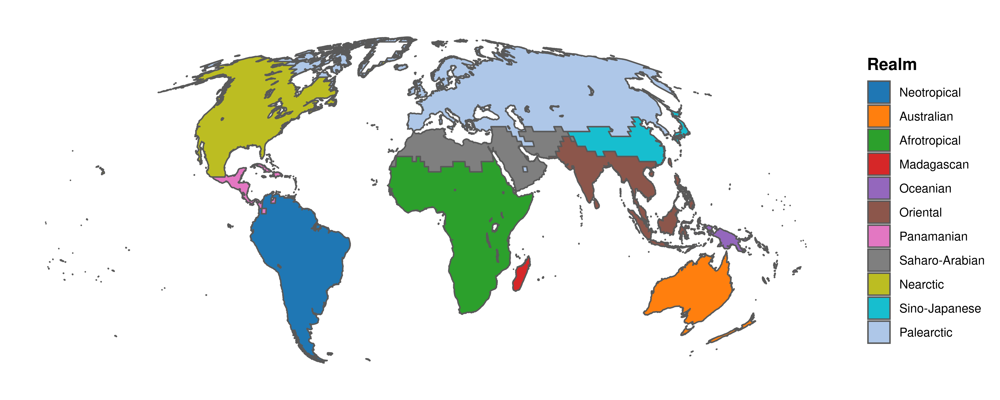

geodat: R package for easy access to various geographical data
================

## Install geodat package

To *use* the package, it can be installed directly from GitHub using the
`remotes` package.

``` r
# Install packages from Github
#install.packages("remotes")
remotes::install_github("RS-eco/geodat")
```

If package installation with `install_github()` fails, try to download
the package using an alternative method (i.e. wget), such as:

``` r
tmp_zip <- tempfile(fileext = ".zip")
source_url <- "https://api.github.com/repos/RS-eco/geodat/zipball/main"
utils::download.file(source_url, destfile=tmp_zip, method="wget")
file.exists(tmp_zip)

remotes::install_local(tmp_zip)
```

After installation, load the package

``` r
library(geodat)
```

**If you encounter a bug or if you have any problems, please file an
[issue](https://github.com/RS-eco/geodat/issues) on Github.**

## Data

### Marine data

``` r
# Exclusive economic zones
data(eez) # only simplified topology, to reduce file size

# Maritime boundaries
data(eez_boundaries)

# Large marine ecosystems
data(lme)

# Marine realms
data(marinerealms)

# Marine ecoregions of the world
data(meow)
```

### Map of marine biogeographic realms

``` r
library(dplyr); library(ggplot2)

# Re-project realm data
marinerealms <- sf::st_transform(marinerealms, "+proj=moll")

# Group by ID2
#marinerealms %<>% group_by(ID2) %>% summarise()

# Correctly merge actual groups
marinerealms <- lapply(marinerealms$ID2, function(x){
  dat <- marinerealms %>% filter(ID2 == x)
  dat <- rgeos::gPolygonize(rgeos::gNode(as(as(dat, "Spatial"), "SpatialLines")))
  dat <- rgeos::gUnaryUnion(dat)
  dat <- sf::st_as_sf(dat)
  dat$ID2 <- x
  return(dat)
})
marinerealms <- bind_rows(marinerealms)

ggplot() + geom_sf(data=marinerealms, aes(fill=ID2)) + coord_sf(datum=NA) + 
  scale_fill_manual(name="Realm", values=ggsci::pal_d3("category20")(15)) + 
  theme_bw() + theme(panel.border = element_blank(), legend.position="bottom",
                     legend.margin=margin(t=0,r=0,b=0, l=0, "cm"),
                     plot.margin = unit(c(0,0,0,0), "cm"),
                     legend.title = element_text(size=12, face="bold", 
                                                 angle=90, vjust=0.5, hjust=0.5)) + 
  guides(fill = guide_legend(nrow = 5))
```

<!-- -->

### Terrestrial data

``` r
# Biomes
data(biomes)

# Terrestrial ecoregions of the world
data(teow)

# Zoogeographic realms of the world
data(zoorealms)
data(zooregions)
```

### Map of zoogeographic realm

``` r
library(sf)

# Wrap dateline
zoorealms <- st_wrap_dateline(zoorealms, options = c("WRAPDATELINE=YES","DATELINEOFFSET=180"))

# Remove invalid topologies and crop to desired extent
#zoorealms <- zoorealms %>% st_make_valid() %>% sf::st_crop(xmin=-180, ymin=-50, xmax=180, ymax=70)

# Re-project realm data
zoorealms <- sf::st_transform(zoorealms, "+proj=moll")

# Plot map of realm data
ggplot() + geom_sf(data=zoorealms, aes(fill=Realm)) + coord_sf(datum=NA) + 
  scale_fill_manual(values=ggsci::pal_d3("category20")(11)) + 
  theme_bw() + theme(panel.border = element_blank(),
                     legend.title = element_text(size=12, face="bold"))
```

<!-- -->
